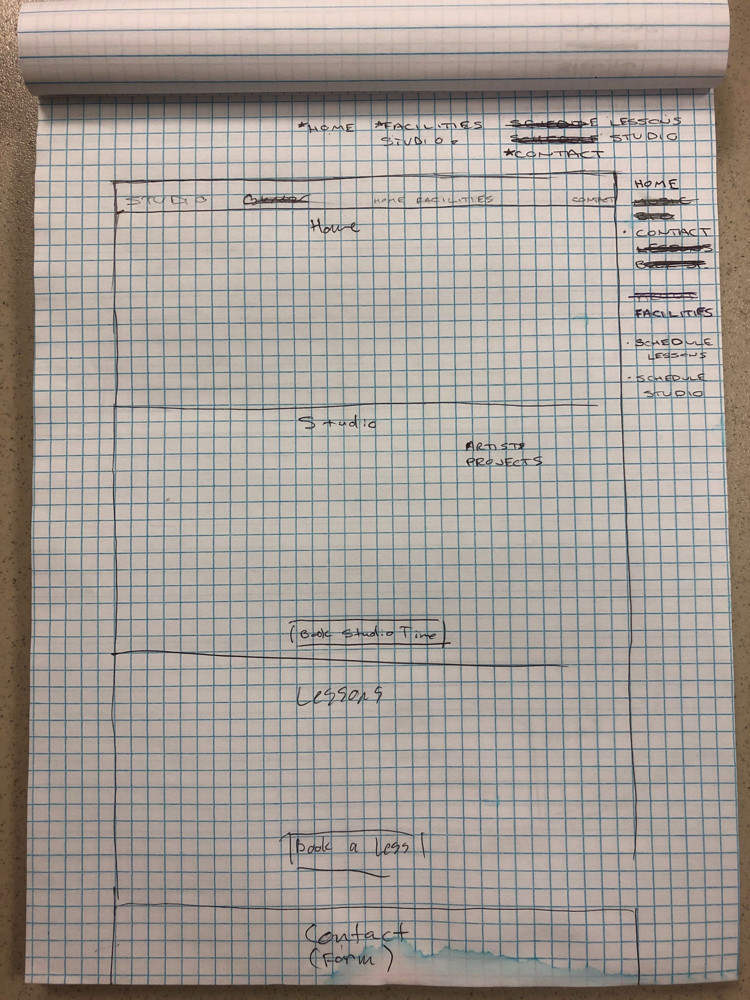
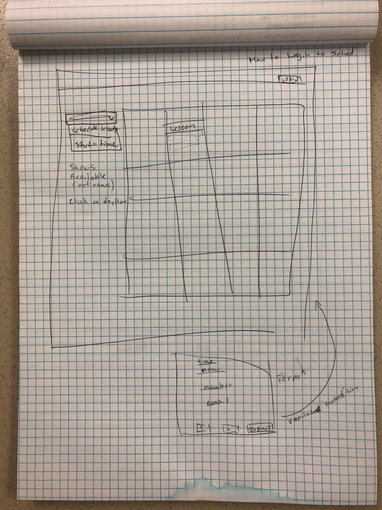
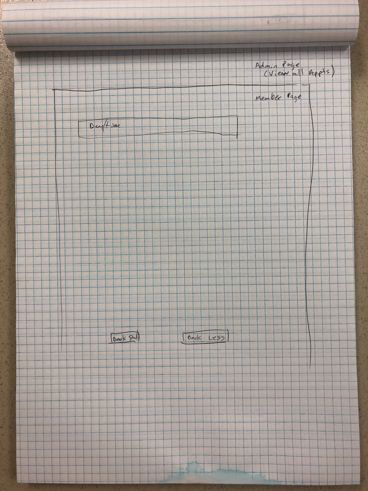

# Studi-Joe (WIP)

## Team Members (roles tbd)
  * Joe Williams -- 
  * Kyle Barnhouse --
  * Race Briggs --
  * Gordon Coutret --

## Overview
"Name" is a full-stack react app designed for a small recording-studio business. 
The functionality of this app can be easily refocused for other businesses.

This app will display the space, the employees, the technology and equipment, and examples of work created by other artists. "Name" will give users a good idea of what is available to them as customers.

Along with this, users will be able to view a schedule of availability and contact the studio directly. 

## The Problem and Solution
Being a small business today is hard. Standing out among big businesses and other small businesses requires more than just a superior product. Small businesses need to be seen, and once seen, they have to hold the consumer's attention and simultaniously leave an impression. There are many ways that businesses can achieve this impression. Web presence and professionalism are great starts. 

When people realize they need a service or a product, what do they do? They go to their phones or their computers and look into their options. Many things are considered; price, convenience, and quality among others. Quality is the main factor when a customer is comparing costs. The best way to give a customer confidence in your product is to present it in a professional manner. Not only do you need to have the best product. You also need to have the best website.

Our goal is to help small business look better than big business. 

## Technologies
  * ReactJS
  * Bootstrap / Bulma
  * Google Calender or another calender package
  * React Infinite Scroll
  * Passport or another form of login
  * Axios
  * MongoDB / Mongoose

### Layout

